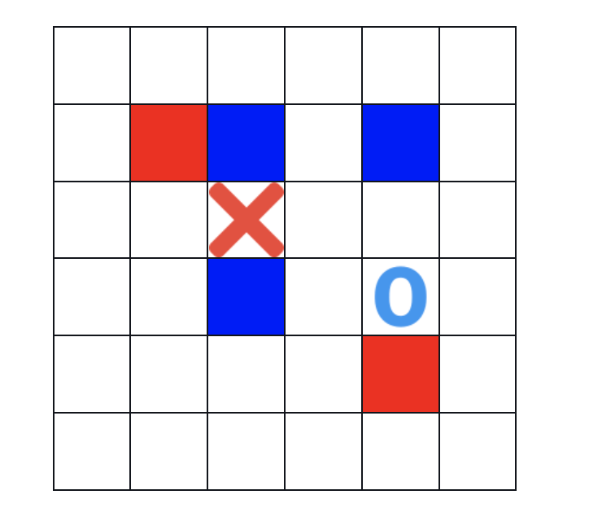
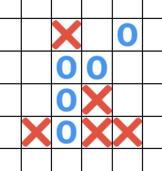
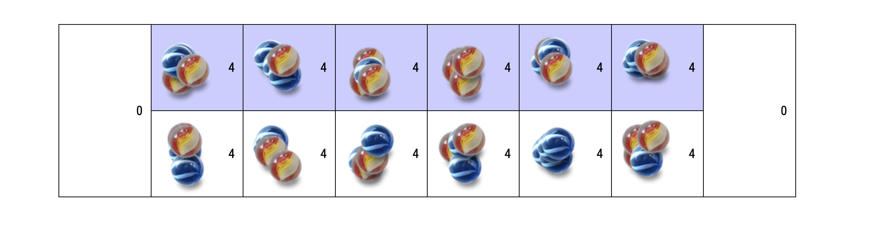
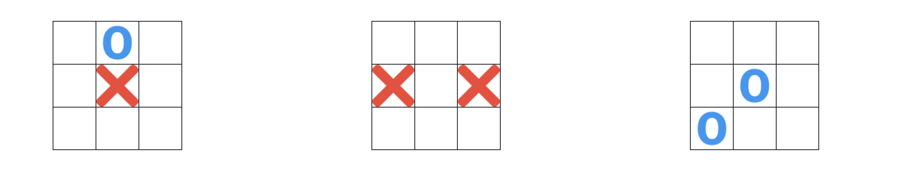
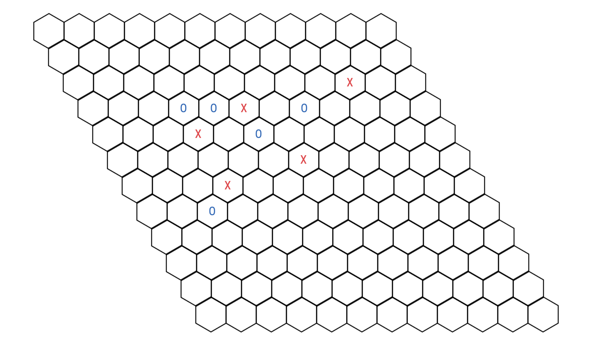

# Math Field Day Games


# Overview 
Math Field Day is a math-based tournament between schools in a district very similar to the Olympics. There are various games such as Mancala and 3-D Tic Tac Toe and mathematically challenging events such as Leap Frog and Number Sense to participate in. Each school sends a team of students to participate in these games, represent their school, and win points. 

The games at my school district were **5 in a Row, Capture, 3-D Tic Tac Toe, Hex, and Mancala**. Check it out! Click on a game and play with a friend, or a rival!

<p align="center">
    <a href="https://math-field-day.netlify.app/">Live Demo</a>
</p>

# Tech Stack


# Games

## Capture 
### Rules
This game is played on a 6x6 grid. The main objective of the game is to avoid placing your symbol(X or O) in a straight or diagonal course from the opponents. 

The starting player marks his symbol anywhere on the grid. The next player then add their symbol avoiding a hit described above. The first player can move their symbol anywhere diagonally, horizontally, or vertically(like a queen in chess) to an unused space and shades in their previous mark. The shaded mark is now a wall.

The opponent moves similarly. The players continue until there is a winner. The winner is determined either by forcing the opponent to no longer have any more usable spots to move (CAPTURED) or moving in a space that is in the direction of the opponent.(CAPTURES)



---

## Five in a Row 
### Rules
Very similary to Tic Tac Toe, but the goal is not 3 in a row, it's 5 in a row. 

Players take turns placing their marks(X or O) in the squares. The first player to get 5 in a row in any direction is the winner.



---

## Mancala 
### Rules
Each turn, a player can choose any square with beads on their side, scoops up the beads, and distributes them one bead at a time in the right direction.  The winner of the game is the first person that gets rid of all the beads on their side. 

If a player's last bead lands in the end hole, they can go again.

If a player's last bead lands in an empty square on the opponent's side, the player can either move the beads on their side opposite to the hole or scoop and place all the beads from the opposite hole to the landed hole. The player can also not move at all when this happens. Whenever a player lands in an empty hole on their side, their turn is over.



---

## 3D Tic Tac Toe
### Rules
There are 3 tic tac to boards this time. The game works similarly to tic tac toe where the winner is decided by getting 3 marks in a row horizontally, vertically, or diagonally. However, the winner can also win by getting three in a row in the same spot of the 3 boards or across the 3 boards.



---

## Hex
### Rules
The winner must form a continous path from their starting side to the opposite side by connecting the hexagons on their edges. The four corners of the board can be considered to be part of either of the sides that they face.



# Improvements
- ```<dialog>``` element can be used instead of creating seperate lightboxes
- Infinite board for 5 in a row? 
- Better mancala animations and usability
- Hex clicking is inaccurate 